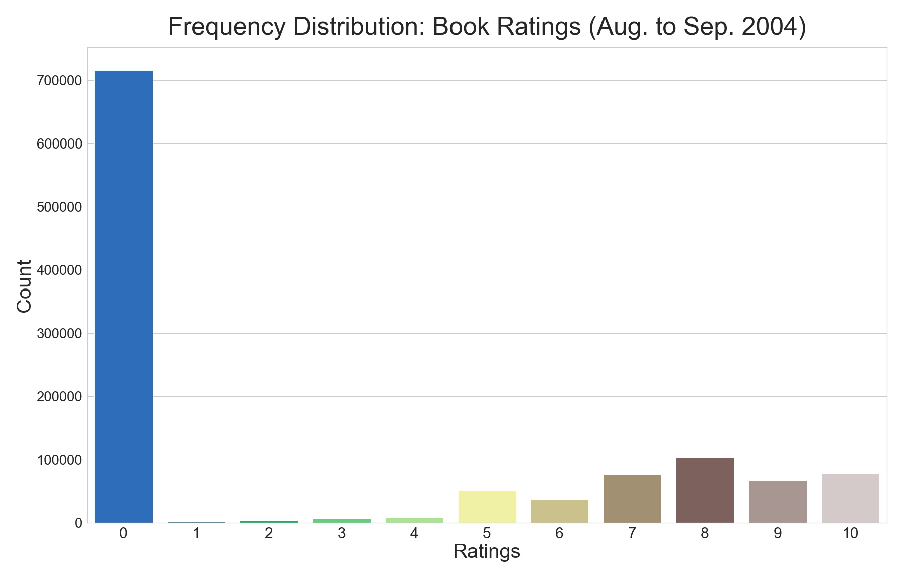
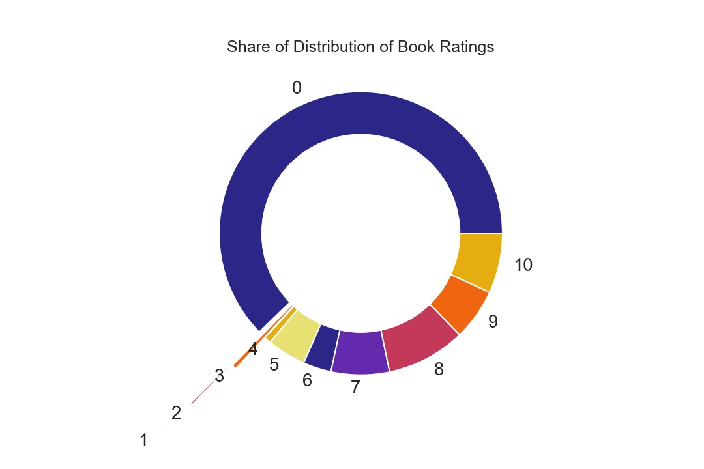
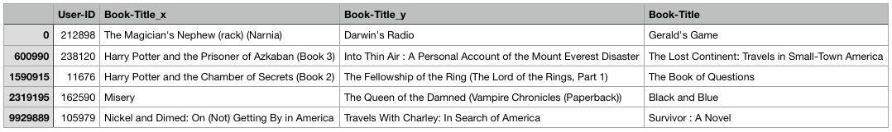

# Book Recommender Model

> by: [:globe_with_meridians: Mark Payumo](https://www.linkedin.com/in/markpayumo/)

Exploratory data analysis and recommender model development of dataset from [Book Crossing](https://www.bookcrossing.com).

## Description

The **goal** of this project is to demonstrate development of a recommender system that highlights trends hidden behind user data that can potentially inform business development of a book store or book club like Book Crossing. It can also give users a go-to resource for other books that might interest them and have them looking forward to as they engage in "the practice of leaving a book in a public place to be picked up and read by others, who then do likewise." 

## Data Source

The model utilizes the dataset that was collected by [Cai-Nicolas Ziegler](http://www2.informatik.uni-freiburg.de/~cziegler/BX/WWW-2005-Preprint.pdf) during a four-week crawl (Aug. to Sep. 2004) of the Book Crossing community. It comes in three CSV files that separately contain the following:

<ul>
    <li>User demographic information such as age and address</li>
    <li>Book ratings on a scale of 0 to 10</li>
    <li>Book titles along with author, publisher, publication, ISBN, etc. </li>
</ul>

## Tech Stack

  

The following were used in the development of the recommender system:

| Tools               | Packages     |
| :----:              | :----:       |
| Python              | Pandas       |
| JupyterLab          | Surprise     |
| AWS Cloud Computing | Matplotlib   |
| Git                 | Seaborn      |

## Exploratory Data Analysis

### Rating Scale

Book Crossing has a sliding scale of 0 to 10 that users utilize to rate the books. There is an overwhelming amount of users in 2004 that gave the books a rating of 0. Overall, there is a total of <code>1,149,780</code> ratings during the specified time period.

The donut chart below shows those books that were rated "0" own the lion's share of the distribution. Ratings 1, 2, and 3 were exploded to avoid overlap and still display their share of the distribution albeit small.

While there is no correlation between average rating and the rating count, this joint plot nevertheless shows that average user ratings cluster between 2 to 5.

### Rated Books by Publication Year

Books published in 2002 were rated the most by 17,627 users. Those that were published between 1975 to 2002 received the most ratings. In order to maintain statistic significance, we will trim down our dataset to this range of years of publication during modeling.

### Countries of Origin

The U.S. tops the list of users' countries of origin at 139,711. Below is just the top 20 out of 707 user-defined countries, which were extracted from the users' text addresses where many are gibberish entries that required further cleaning through text manipulation.

---

## Modeling

> ### Evaluation Metric: Root Mean Squared Error (RMSE)

### Baseline Predictor: The Dumb Model

In order to benchmark our recommender system's performance, we need a baseline model to compare it with. I utilized the array of values from (1) the average rating of each book's unique ISBN code and (2) the total number ratings received by each unique book based on their ISBN codes.

Sci-kit Learn's mean_squared_error metric function was particularly helpful that yielded an <code>RMSE</code> of <code>3.597</code> for our **dumb model**. The arrays of values that simulated actual and predicted book ratings are from the "Most Rated Books" dataframe.

### Cold Start: Top 10 Most Rated

In the case of a brand new user with no prior information on their preference, we defer to the most rated books as shown below.

### Pearson R

We use Pearson correlation as a basic form of model, allowing us to pick out those that are strongly correlated to a book of choice based on the book's ISBN code. The Pearson R model is [here.](https://github.com/mpayumo/book-recommender-model/tree/master/model) Below is a sample of recommended books on a randomly chosen ISBN code, <code>0316666343</code>.

### Best Estimator with Surprise

The more nuanced modeling process is based on heavy use of the **Surprise** package that allowed us to iterate and cross-validate through different algorithms as shown below. Cross-validation was set to **5 folds** and utilized the **root mean squared error (RMSE)** as our **evaluation metric** to determine which algorithm will give us the best predictions. The iteration is shown on the table below.

Before moving further, here is a comparison of the RMSE scores. BaselineOnly algorithm gave us the lower score that we can be comfortable with using for now.

| RMSE (Baseline) | RMSE (Best Estimator) |
| :----:          | :----:                |
| 3.597           | 3.329                 |

Below is the cross validation and iteration through various algorithms with RMSE as an evaluation metric similarly utilized to determine which will be our best estimator.

BaselineOnly becomes our algorithm of choice as it shows the most promise with the lowest RMSE of <code>3.329</code>. We then set our top N recommended books to 3, but the model is flexible to recommend as many as there are in the predictions.

---

## Recommendations

> ### The top 3 book titles are recommended for our top 5 random users as shown below.

---

## Future Direction and Next Steps

The model will further benefit from the following for improvement and more accurate results:

<ul>
    <li>Tuning best estimator with GridSearchCV</li>
    <li>Deep Learning</li>
    <li>Flask Integration</li>
</ul>
